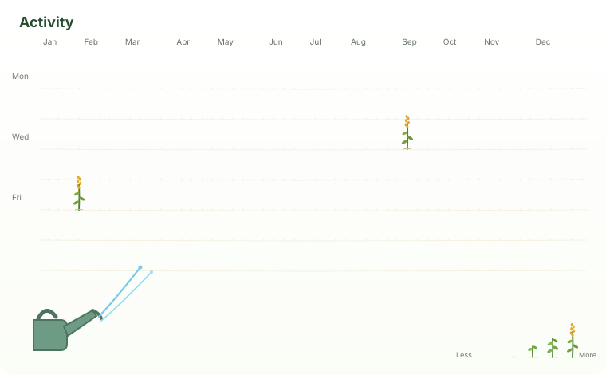
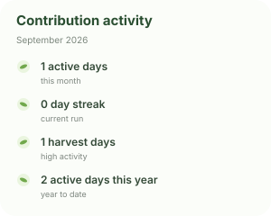

  

<table>
<tr>
<td width="24%" valign="top">

### 🌿 Projects I'm Building

**ihhr**  
Intelligent HR system — current product line.

**ai-literacy**  
AI-literacy and Next Token Lab research work.

**mlpractical**  
Machine-learning practical work.

</td>
<td width="52%" valign="top">

### 🌱 Activity

</td>
<td width="24%" valign="top">

### 🌿 Tech Stack

`Python` · `TypeScript` · `React`  
`FastAPI` · `PostgreSQL`  
`Docker` · `Git`

### 〽️ Contribution activity

</td>
</tr>
</table>

春种一粒粟，秋收万颗子。

